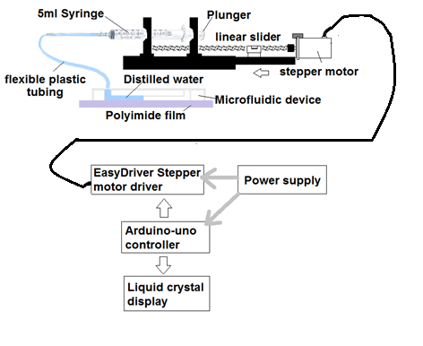

# Group Final Project: [Syringe pump]
## Introduction
A syringe pump is a type of medical device used to deliver precise amounts of fluids, such as
medications or nutrients, into a patient's body. It operates by pushing the plunger of a syringe at a
controlled rate, ensuring accurate and consistent flow of the fluid. Syringe pumps are commonly
used in various medical settings, including hospitals, clinics, and research laboratories.
## Project objective:
The objective of this project is to design and build a functional prototype of a syringe pump,
a medical device used to deliver precise amounts of fluids, such as medications or nutrients,
into a patient's body. This project aims to provide students with hands-on experience in
engineering, electronics, programming, and medical device desig

## Flow Chart and Block Diagram

